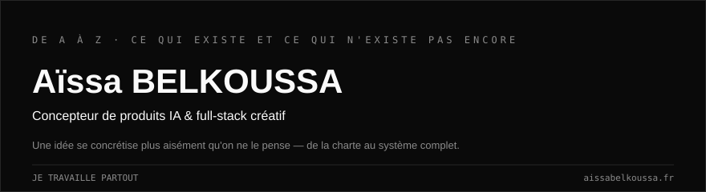

`Autodidacte depuis mes 2 ans` · `Concepteur IA & full-stack créatif` · `De A à Z`

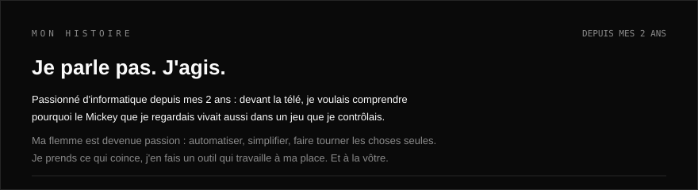

## Ce que je fais

| Je construis | J'audite | Je co-fonde |
| --- | --- | --- |
| Des IA sur mesure et du code qui rend du temps aux gens. Seul, de bout en bout. | Des architectures IA pour d'autres. Challenger un système vaut autant que le bâtir. | Une plateforme citoyenne, pour que ce que je code serve au-delà de moi. |

**De A à Z · Builder, pas consultant · Rien n'est impossible**

## De A à Z

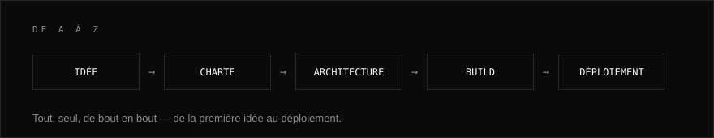

## Le pipeline, en vrai

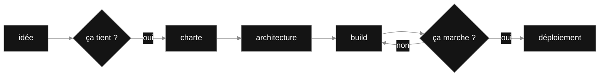

## Ce que je construis

Toujours pour la même raison : rendre du temps aux gens, et donner forme à ce qui n'existait pas.

### Projets en vedette

<a href="https://github.com/aissablk1/speckitlab">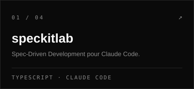</a>
<a href="https://github.com/aissablk1/cupel">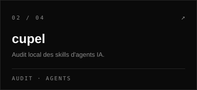</a>
<a href="https://github.com/aissablk1/communikey">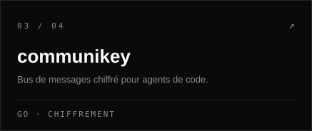</a>
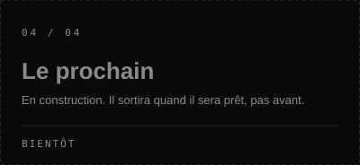

## Ce que j'explore

Je touche à tout, par curiosité autant que par plaisir. Pas de stack préférée — j'aime créer, point.

| | |
| --- | --- |
| **Langages** | `TypeScript` · `JavaScript` · `Go` · `Rust` · `Python` · `Luau` · `Swift` · `Shell` · `Ruby` |
| **Agents & IA** | `Claude Code` · `Cursor` · `Codex` · `MCP` · tous les agents |
| **Web** | `Next.js` · `Tailwind` · `Vercel` |
| **Bout en bout** | `Charte graphique` · `Architecture` · `Déploiement` |

<!-- PULSE:START -->
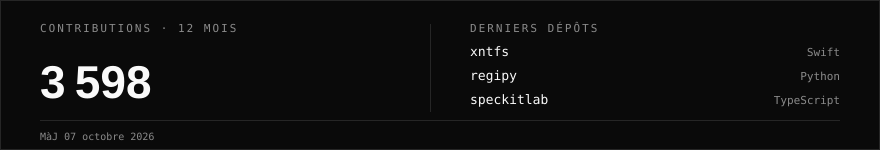
<!-- PULSE:END -->

## Me parler

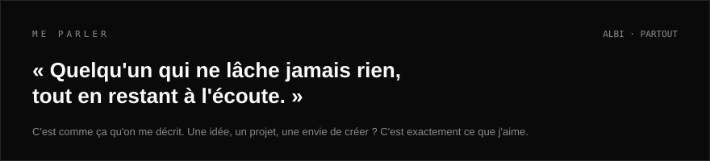

<a href="https://www.aissabelkoussa.fr/contact">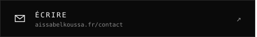</a>
<a href="https://www.aissabelkoussa.fr">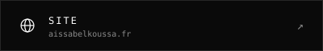</a>
<a href="https://www.linkedin.com/in/aissabelkoussa">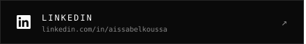</a>
<a href="https://github.com/aissablk1">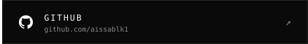</a>

