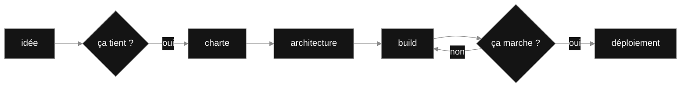

`Autodidacte depuis mes 2 ans` · `Concepteur IA & full-stack créatif` · `Albi, FR` · `De A à Z`

## Ce que je fais

| Je construis | J'audite | Je co-fonde |
| --- | --- | --- |
| Des IA sur mesure et du code qui rend du temps aux gens. Seul, de bout en bout. | Des architectures IA pour d'autres. Challenger un système vaut autant que le bâtir. | Une plateforme citoyenne, pour que ce que je code serve au-delà de moi. |

**De A à Z · Builder, pas consultant · Rien n'est impossible**

## De A à Z

## Le pipeline, en vrai

## Ce que je construis

Toujours pour la même raison : rendre du temps aux gens, et donner forme à ce qui n'existait pas.

### Projets en vedette
| | |
| --- | --- |
| **[speckitlab](https://github.com/aissablk1/speckitlab)** Spec-Driven Development pour Claude Code. `TypeScript` · `Claude Code` | **[cupel](https://github.com/aissablk1/cupel)** Audit local des skills d'agents IA. `Audit` · `Agents` |
| **[communikey](https://github.com/aissablk1/communikey)** Bus de messages chiffré pour agents de code. `Go` · `Chiffrement` | **Le prochain** En construction. Il sortira quand il sera prêt, pas avant. `Bientôt` |

## Ce que j'explore

Je touche à tout, par curiosité autant que par plaisir. Pas de stack préférée — j'aime créer, point.

| | |
| --- | --- |
| **Langages** | `TypeScript` · `JavaScript` · `Go` · `Rust` · `Python` · `Luau` · `Swift` · `Shell` · `Ruby` |
| **Agents & IA** | `Claude Code` · `Cursor` · `Codex` · `MCP` · tous les agents |
| **Web** | `Next.js` · `Tailwind` · `Vercel` |
| **Bout en bout** | `Charte graphique` · `Architecture` · `Déploiement` |

<!-- PULSE:START -->

<!-- PULSE:END -->

## Me parler

On me décrit comme « quelqu'un qui ne lâche jamais rien, tout en restant à l'écoute ». Une idée, un projet, une envie de créer ? C'est exactement ce que j'aime.

[Me parler](https://www.aissabelkoussa.fr/contact) · [Site](https://www.aissabelkoussa.fr) · [LinkedIn](https://www.linkedin.com/in/aissabelkoussa) · [GitHub](https://github.com/aissablk1)
