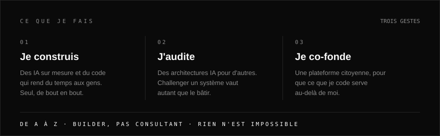
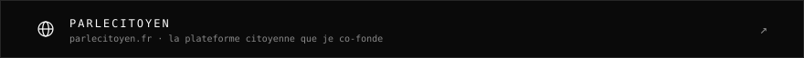
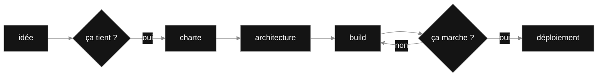
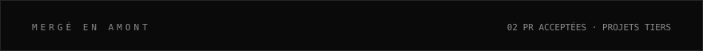
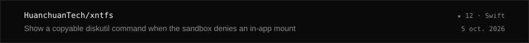
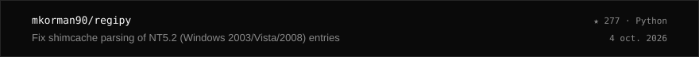
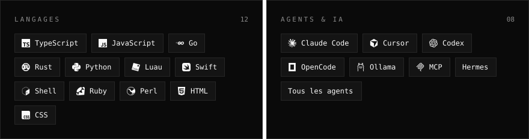
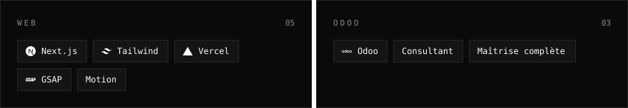
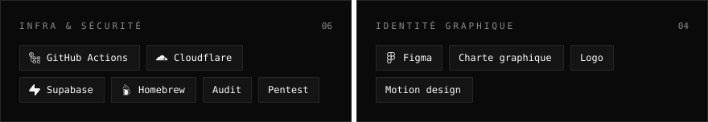
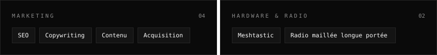

<picture>
<source media="(max-width: 600px)" srcset="assets/m/hero.svg">

</picture>

`Autodidacte depuis mes 2 ans` · `Concepteur IA & full-stack créatif` · `De A à Z`

<picture>
<source media="(max-width: 600px)" srcset="assets/m/story.svg">

</picture>

## Ce que je fais

<!-- DOING:START -->

<picture><source media="(max-width: 600px)" srcset="assets/m/doing.svg"></picture><a href="https://parlecitoyen.fr"><picture><source media="(max-width: 600px)" srcset="assets/m/cofonde.svg"></picture></a>

<!-- DOING:END -->

## De A à Z

<picture>
<source media="(max-width: 600px)" srcset="assets/m/process.svg">

</picture>

## Le pipeline, en vrai

## Ce que je construis

Toujours pour la même raison : rendre du temps aux gens, et donner forme à ce qui n'existait pas.

### Projets en vedette

<!-- PROJECTS:START -->

<a href="https://github.com/aissablk1/speckitlab"><picture><source media="(max-width: 600px)" srcset="assets/m/projects/speckitlab.svg"></picture></a><a href="https://github.com/aissablk1/cupel"><picture><source media="(max-width: 600px)" srcset="assets/m/projects/cupel.svg"></picture></a><a href="https://github.com/aissablk1/communikey"><picture><source media="(max-width: 600px)" srcset="assets/m/projects/communikey.svg"></picture></a><picture><source media="(max-width: 600px)" srcset="assets/m/projects/prochain.svg"></picture>

<!-- PROJECTS:END -->

### Mergé en amont

Des correctifs acceptés par les mainteneurs de projets que je ne contrôle pas.

<!-- UPSTREAM:START -->

<picture><source media="(max-width: 600px)" srcset="assets/m/upstream/head.svg"></picture><a href="https://github.com/HuanchuanTech/xntfs/pull/6"><picture><source media="(max-width: 600px)" srcset="assets/m/upstream/pr-1.svg"></picture></a><a href="https://github.com/mkorman90/regipy/pull/347"><picture><source media="(max-width: 600px)" srcset="assets/m/upstream/pr-2.svg"></picture></a>

<!-- UPSTREAM:END -->

## Ce que j'explore

Je touche à tout, par curiosité autant que par plaisir. Pas de stack préférée — j'aime créer, point.

<!-- EXPLORE:START -->

<picture><source media="(max-width: 600px)" srcset="assets/m/explore/row-1.svg"></picture><picture><source media="(max-width: 600px)" srcset="assets/m/explore/row-2.svg"></picture><picture><source media="(max-width: 600px)" srcset="assets/m/explore/row-3.svg"></picture><picture><source media="(max-width: 600px)" srcset="assets/m/explore/row-4.svg"></picture>

<!-- EXPLORE:END -->

<!-- PULSE:START -->
<picture>
<source media="(max-width: 600px)" srcset="assets/m/pulse.svg">

</picture>
<!-- PULSE:END -->

## Me parler

<picture>
<source media="(max-width: 600px)" srcset="assets/m/contact.svg">

</picture>

<!-- CONTACT:START -->

<a href="https://www.aissabelkoussa.fr/contact"><picture><source media="(max-width: 600px)" srcset="assets/m/contact/mail.svg"></picture></a><a href="https://www.aissabelkoussa.fr"><picture><source media="(max-width: 600px)" srcset="assets/m/contact/site.svg"></picture></a><a href="https://www.linkedin.com/in/aissabelkoussa"><picture><source media="(max-width: 600px)" srcset="assets/m/contact/linkedin.svg"></picture></a><a href="https://github.com/aissablk1"><picture><source media="(max-width: 600px)" srcset="assets/m/contact/github.svg"></picture></a>

<!-- CONTACT:END -->
