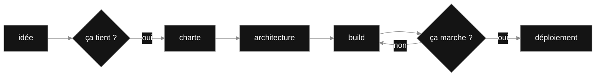
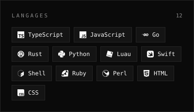
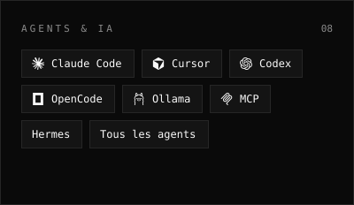
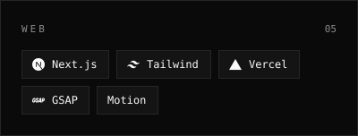
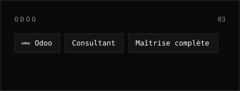
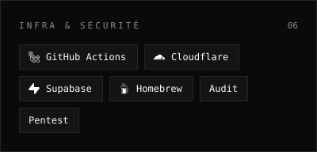
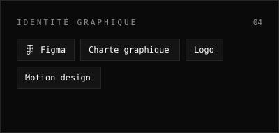
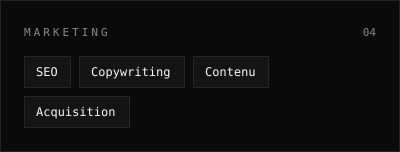
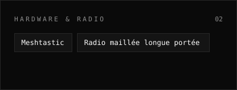

<picture>
<source media="(max-width: 600px)" srcset="assets/m/hero.svg">

</picture>

`Autodidacte depuis mes 2 ans` · `Concepteur IA & full-stack créatif` · `De A à Z`

<picture>
<source media="(max-width: 600px)" srcset="assets/m/story.svg">

</picture>

## Ce que je fais

<picture>
<source media="(max-width: 600px)" srcset="assets/m/doing.svg">

</picture>

## De A à Z

<picture>
<source media="(max-width: 600px)" srcset="assets/m/process.svg">

</picture>

## Le pipeline, en vrai

## Ce que je construis

Toujours pour la même raison : rendre du temps aux gens, et donner forme à ce qui n'existait pas.

### Projets en vedette

## Ce que j'explore

Je touche à tout, par curiosité autant que par plaisir. Pas de stack préférée — j'aime créer, point.

<!-- PULSE:START -->
<picture>
<source media="(max-width: 600px)" srcset="assets/m/pulse.svg">

</picture>
<!-- PULSE:END -->

## Me parler

<picture>
<source media="(max-width: 600px)" srcset="assets/m/contact.svg">

</picture>

